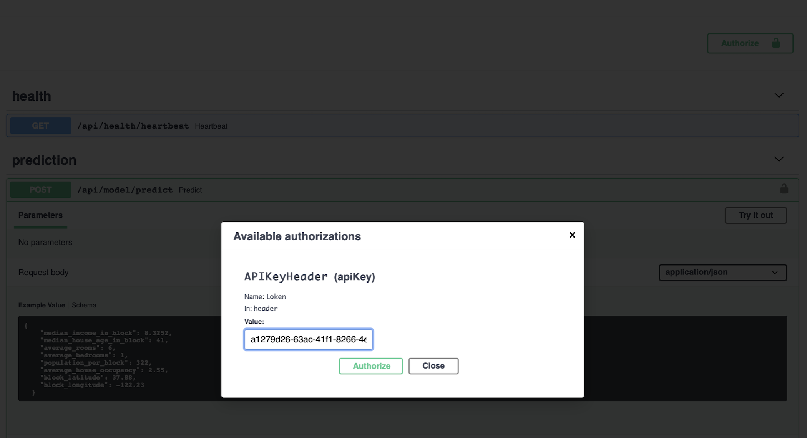
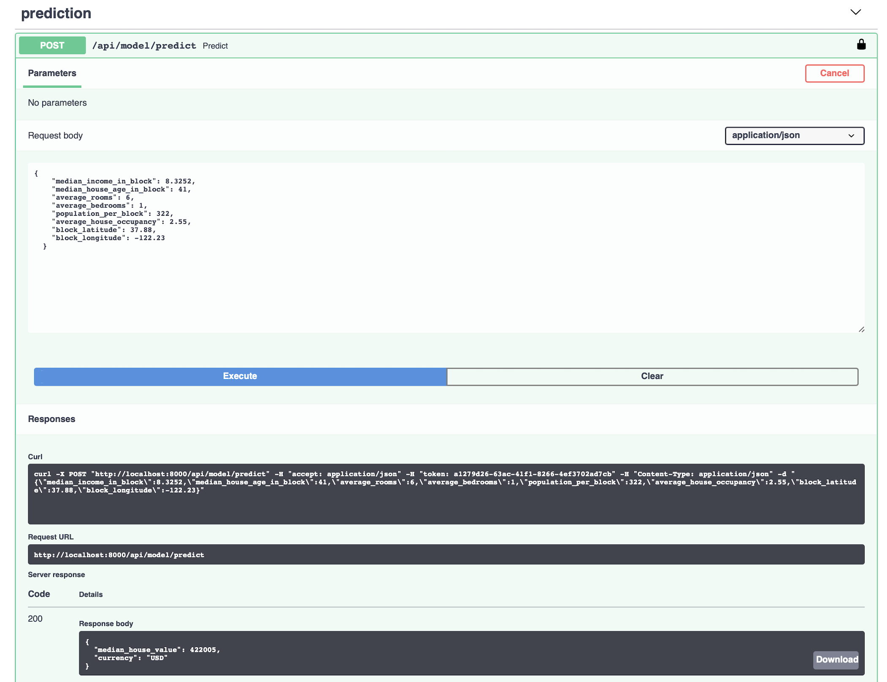

# FastAPI Model Server Skeleton

Serving machine learning models production-ready, fast, easy and secure powered by the great FastAPI by [Sebastián Ramírez]([)](https://github.com/tiangolo).

This repository contains a skeleton app which can be used to speed-up your next machine learning project. The code is fully tested and provides a preconfigured `tox` to quickly expand this sample code.

To experiment and get a feeling on how to use this skeleton, a sample regression model for house price prediction is included in this project. Follow the installation and setup instructions to run the sample model and serve it aso RESTful API.

## Requirements

- Python 3.11+
- Poetry

## Installation
Install the required packages in your local environment (ideally virtualenv, conda, etc.).

```bash
poetry install
``` 


## Setup
1. Duplicate the `.env.example` file and rename it to `.env` 


2. In the `.env` file configure the `API_KEY` entry. The key is used for authenticating our API. <br>
   A sample API key can be generated using Python REPL:

```python
import uuid
print(str(uuid.uuid4()))
```

## Run It

1. Start your  app with:

```bash
set -a
source .env
set +a
uvicorn fastapi_skeleton.main:app
```

2. Go to [http://localhost:8000/docs](http://localhost:8000/docs).
3. Click `Authorize` and enter the API key as created in the Setup step.
 
4. You can use the sample payload from the `docs/sample_payload.json` file when trying out the house price prediction model using the API.
   

## Linting

This skeleton code uses isort, mypy, flake, black, bandit for linting, formatting and static analysis.

Run linting with:

```bash
./scripts/linting.sh
```

## Run Tests

Run your tests with:

```bash
./scripts/test.sh
```

This runs tests and coverage for Python 3.11 and Flake8, Autopep8, Bandit.


## Changelog

v.1.0.0 - Initial release

- Base functionality for using FastAPI to serve ML models.
- Full test coverage 

v.1.1.0 - Update to Python 3.11, FastAPI 0.108.0

- Updated to Python 3.11
- Added linting script
- Updated to pydantic 2.x
- Added poetry as package manager

